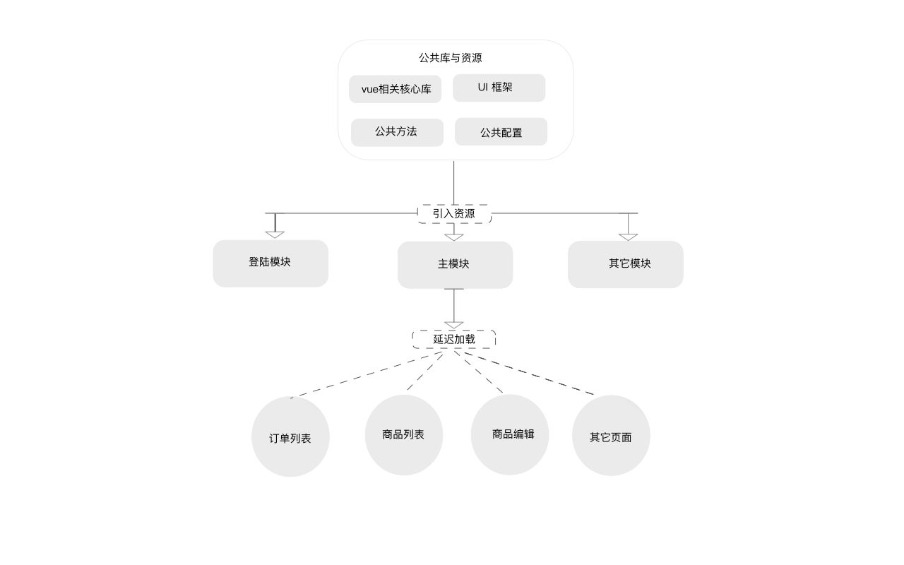

# cms-vue

## 相关技术
vue + vue-router + vuex

## 项目结构

```
src
+-- assets  (资源目录)
+-- components  (自定义组件)
|   +-- upload-image.vue
+-- config  (项目配置)
|   +-- urls.js
+-- lib (公共方法)
|   +-- extension.js
|   +-- net.js
|   +-- utils.js
+-- modules (系统模块)
|   +-- login
|   |   +-- script.js   (登录模块入口)
|   |   +-- style.scss
|   |   +-- view.vue
|   +-- main
|       +-- pages (主模块单页面)
|       |   +-- good-edit
|       |   |   +-- page.js
|       |   |   +-- style.scss
|       |   |   +-- view.vue
|       |   +-- goods
|       |   |   +-- page.js
|       |   |   +-- style.scss
|       |   |   +-- view.vue
|       |   +-- order
|       |   |   +-- page.js
|       |   |   +-- style.scss
|       |   |   +-- view.vue
|       |   +-- router.js
|       +-- script.js   (主模块入口)
|       +-- store
|       |   +-- keys.js
|       |   +-- store.js
|       +-- style.scss
|       +-- view.vue
+-- style   (公共样式方法与属性)
|   +-- variables.scss
+-- template    (页面模板)
    +-- index.html

```

## 构建模块示意图

